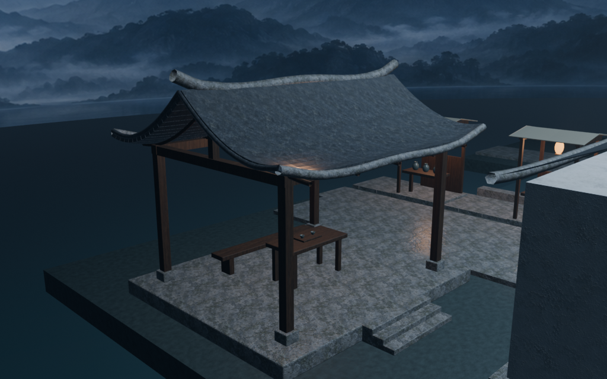
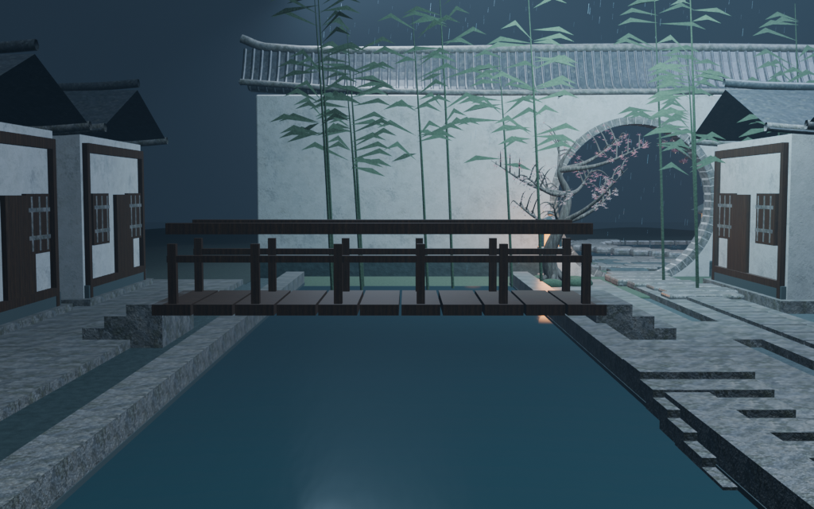

# 江南小镇 · 首轮审阅包

这是源提交 12c7b99fbf961160429b69f27cd203cfef92d752 的真实模型与16张原生1024×640诊断图。代码已合入主线。

[完整离线图集](gallery.html) · [16张PNG原图与对照](images.zip) · [可编辑Blender模型](blender.zip)

[本轮实图构建](https://github.com/XDHRY/yanyu-jiangnan/actions/runs/37494269409) · [模型构建](https://github.com/XDHRY/yanyu-jiangnan/actions/runs/37494269240)

新增连续双岸地基、三条石街、桥头踏步、茶亭和两处摊亭。图集保留庭院核心机位及聚焦近景；11号总平面临时排除月亮、云和雾，建筑保持可见。全部图像来自已验证产物，此次打包未重渲染、未更改模型。

小镇持续建设中，贯通门窗与室内、岸边绿化、铺装和檐下细节待下一轮精修。完整Form/Runtime批准尚未完成。
